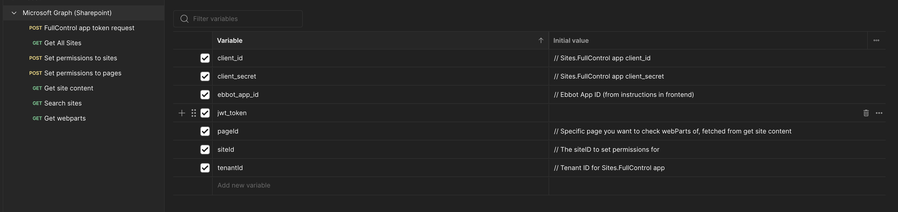

# Ebbot SharePoint Postman Guide

### **What is Postman?**&#x20;

**Postman** is a popular tool used by developers to design, test, and document APIs. It simplifies API testing with an intuitive interface, allowing users to send requests, inspect responses, and automate testing. It is widely used for its efficiency and ease of use in managing and debugging APIs.

* Please note that you may need to create an account to use Postman. This guide and collection prioritize ease of use and importability, but you can make the same calls with any other preferred API management tool. Download Postman [here](https://www.postman.com/).

### Collection of API calls and setting variables


Import this collection into your Postman instance


We have created a collection that contains all the necessary calls needed to set up the permissions, you will need to configure the variables to match with your apps credentials:&#x20;

<figure><figcaption></figcaption></figure>

Start by navigating to the top of the collection "Microsoft Graph (Sharepoint)" and select the "Variables" tab. By default, you will see whats on the image above. You will also see a column for "Current value". This is where you want to add the credentials.

* client\_id - Application (client) ID
* client\_secret - Secret **value** for full control app
* tenantId - Directory (tenant) ID

These are the initial credentials you'll need. They can be found by going to portal.azure.com -> App registrations -> Your Full control app page overview - with the exception of client\_secret which can be found under Certificates & secrets on the same page.

Once filled, navigate to the "FullControl app token request" call in Postman\
Sending the call will generate a jwt token and automatically set it in the jwt\_token variable. This token is needed for the following operations, searching sites and granting permissions.&#x20;

### Finding siteId's

Next step is to find the sites you want to grant permissions to. This can be done in different ways, the postman collection has two methods of doing it:&#x20;

#### Get All Sites

This call returns a list of all sites in the SharePoint environment. The response can be long and it may be hard to find the relevant sites here as it will return everything.&#x20;

```
GET https://graph.microsoft.com/v1.0/sites/getAllSites
```

#### Search sites

Another method is to search among the sites, this should be easier to use and return the specific sites you search for, for example display name of the site.

```
GET https://graph.microsoft.com/v1.0/sites?search=your search string
```

<figure><figcaption></figcaption></figure>

#### Grabbing the ID

Regardless of which method is used, the siteId is needed to both grant permissions for Ebbot, but also to provide inside ebbot app. When you find the sites you want to allow, save the full string of the "id" field in the response into a note, you will need to make a separate call **for each id** and also add them in Ebbot later.

```
helloebbot.sharepoint.com,47772730-ca4f-4ff0-95a0-f4f5e9ea01d3,d16f172a-26ba-4c24-ac75-e3b25a28dfac
```

### Granting read permissions

When you have a list of IDs of the sites you want to fetch into Ebbot, its time to run the "Set permissions to sites" call in postman, for each siteId you have stored.&#x20;

```
POST https://graph.microsoft.com/v1.0/sites/{{siteId}}/permissions
```

Replace \{{siteId\}} with the full id and send the request - the response will display which roles have been set, which is "read" in this postman collection:\
.png>)

Repeat the above step for each site you want to grant permissions to. You should then be ready to create a new source using SharePoint API in the Ebbot platform.&#x20;

<figure><figcaption></figcaption></figure>
