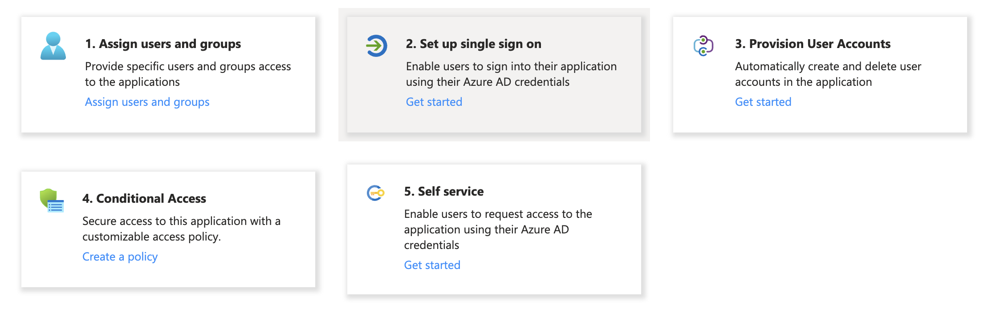
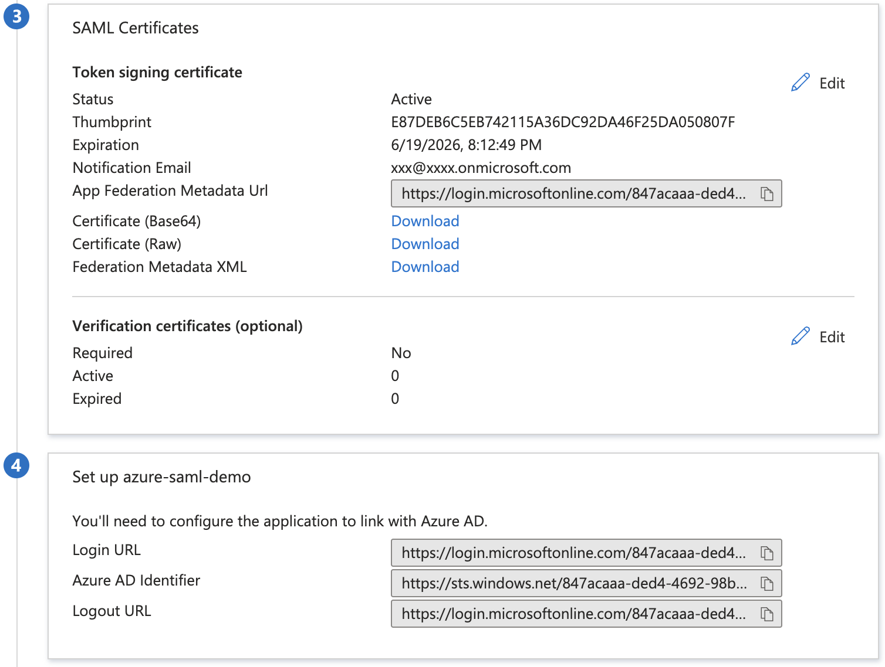

# Configure SAML in Azure

## Prerequisites

To be able to follow this guide you need to have access to Azure Portal. You also need a Federation Metadata file sent to you from Ebbot. Please contact us to request the file.&#x20;

## Add an enterprise application

To add an enterprise application to your tenant:

1. Go to [Azure portal ](https://portal.azure.com/)and sign in using your account
2. Browse to **Azure Active Directory** and select **Enterprise applications**.
3. Click on **New application** -> **Create your own application**
4. Give the app a name
5. Select **Integrate any other application you don't find in the gallery(Non-gallery)**
6. Click on **Create**

### Set up single sign on

Click on **Set up single sign on** and choose SAML at the next step.&#x20;

<figure><figcaption></figcaption></figure>

On the next step you need to configure the Basic SAML Configuration.Our recommendation is to upload the metadata file but you can also configure it manually if you like.

<table><thead><tr><th width="398">Parameter</th><th>Value</th></tr></thead><tbody><tr><td>Identifier (Entity ID)</td><td><a href="https://account.v2.ebbot.app/realms/ebbot">https://account.v2.ebbot.app/realms/ebbot</a> / <a href="https://account.v2.ebbot.app/realms/ebbot">https://account.ebbot.eu/realms/ebbot</a></td></tr><tr><td>Reply URL ( Assertion Consumer Service URL)</td><td>Will be provided by Ebbot</td></tr><tr><td>Sign on URL</td><td>Will be provided by Ebbot</td></tr><tr><td>Relay State</td><td>not needed</td></tr><tr><td>Logout Url</td><td>not needed</td></tr></tbody></table>

#### **Attributes & Claims**

You need to configure the following attributes.&#x20;

| Attribute   | Description                                                                          | Example value                |
| ----------- | ------------------------------------------------------------------------------------ | ---------------------------- |
| First Name  |                                                                                      |                              |
| Last Name   |                                                                                      |                              |
| Email       | Must be email                                                                        |                              |
| Username    | Must be email                                                                        |                              |
| Bots        | The id of the bot or bots that the user should have access to                        | ebbot-access-bot-eby03403249 |
| Skills      | The id of the skill. Only needed if you use skills                                   | ebbot-access-bot-3204230     |
| Roles       | The name of the role. Custom name of one of our default roles: admin,owner,chat user | ebbot-access-role-admin      |

### Information needed by Ebbot

As a last step you need to provide Ebbot with some information to be able to finish the configuration.

Provide Ebbot with the following information.

* App Federation Metadata Url
* Login URL
* Azure AD Identifier
* Logout URL

<figure><figcaption></figcaption></figure>
