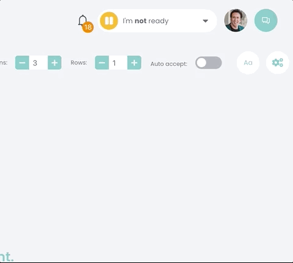
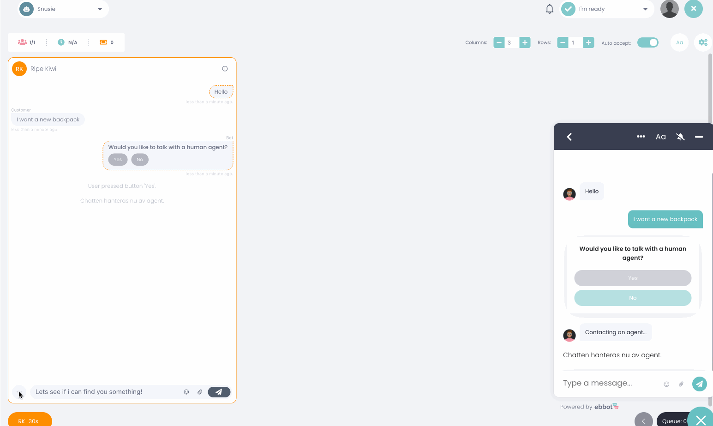

# Release notes

## 2024


## 7/2024 'Max'

<details>

<summary>Release notes</summary>

_Features:_

* **Added WYSIWYG Editor to the Live Chat Page:** Implemented markdown text formatting with a new input field including the WYSIWYG editor, allowing agents to format their responses before sending them.
* **BankID - Set Language for Verification:** The BankID card now includes a language toggle, allowing the language for verification flows to be set independently of the bot's language.
* **BankID - Provider support for ID-kollen:** ID-kollen is now supported in the Ebbot BankID integration.&#x20;
* **Incoming Webhooks - Trigger Scenario and Set Variables in the Same Call:** Simplified API calls by allowing scenarios and variable settings to be combined in one call.
* **Conversation Starter-Buttons linked to URL:** Conversation starters can now display buttons that lead directly to URLs, previously it would only trigger scenarios in the widget.
* **GPT persona preset placeholder syntax:** The GPT Persona editor now accepts the same placeholder syntax as the bot studio - `{{ botName }}, {{ companyName }}`.
* **Improved EbbotGPT's understanding of time:** EbbotGPT now knows which timezone it's in and can respond with the correct time.&#x20;
* **Added "Last Logged In" to Account Management user list:** Admins can now see when users last logged in.&#x20;

_Bug Fixes:_

* **Fixed a bug causing JSON not to be uploaded as source in the Knowledge Manager.**
* **Fixed an issue that would prevent users from creating Shortcuts.**
* **Training Center page loading issue:** Fixed an issue where training center sometimes crashed on load.
* **Wrong timestamp in Data Sources:** Fixed an issue where the wrong createdAt timestamp was being displayed.
* **Button position choices in Conversation Starters:** Fixed an issue where both options for positioning buttons were the same. They now have clear options.
* **Chat history datepicker:** Fixed an issue where the datepicker would randomly select dates upon hovering over it.
* **Hyperlinking not working**: Fixed an issue where hyperlinks could not be created in the bot studio markdown editor.

_Other:_

* **Ended support for the old Chat Widget design:** The old widget can no longer be selected in the styling settings.

</details>

## 6/2024 'Jarvis'

<details>

<summary>Release notes</summary>

### News

**Conversation starter improvements:**&#x20;

* **Text-input field:** A new conversation starter feature allows users to write text directly into the conversation starter without opening the chat widget.
* Added support for multiple URL conditions to trigger conversation starters.
* Changed the way conversation starters initializes a chat, chats will now be initialized only when the user interacts with the conversation starter.
* Quick Reply conversation starters now display the CS text and the user's clicked button in the chat widget upon interacting with it.&#x20;
* Fixed a bug where the clicking the close X would still trigger some conversation starters.
* Playing scenarios through conversation starters will now clear other messages if the chat is not initialized. For example, welcome message will no longer be displayed above the conversation starter target scenario.&#x20;
* Fixed inconsistencies between having starting page turned on vs off.&#x20;

**Dashboard & Metric improvements:**&#x20;

* **New dashboard page:** Dashboards have been moved from the sidebar to its own searchable overview page.
* **Export dashboard to xlsx:** It's now possible to export dashboards as xlsx-files (excel).
* **Dashboard chart edit:** Fixed bug causing charts to change type to line when clicking edit.

**Chats & Widget**

* **Blob call to action:** Added possibility in styling editor to add text next to your chat widget blob.&#x20;
* **Live chat rating:** Agents can now see what rating the user give the conversation directly in the live chat.
* Code blocks in "Show sources" now wrap text correctly where long texts would overflow the widget.&#x20;
* Code blocks now have code friendly fonts by default
* Fixed a bug where marked text would deselect automatically.&#x20;

### Other bug fixes

* Added tooltip for theme matching under Styling
* Various UI texts/typos/mistranslations fixed
* Fixed a bug where one bots schedule would affect the opening hours on bots without schedules.&#x20;
* Visual bug fixed with save filter preset menu
* **Update source:** Clicking update source on a specific source in the dataset settings now works as intended.
* **Copy text in widget:** Select and copy text in widget now works as intended.
* **Emoji & star rating:** Bug fixed with rating card that caused emojis to turn into stars when clicked.&#x20;

</details>

## 5/2024 'Samantha'

<details>

<summary>Release notes</summary>

### EbbotGPT

* **New GPT-model:** We've released a new Llama 3 based GPT-model called 0.6.4.
* **Added support for models with larger context:** Models with large context windows, such as gpt4-turbo-128k, works with EbbotGPT.

### News

* **Sitevision API URLs:** URLs have been added to documents retrieved from Sitevision's API.
* **Conversation starter UI:** It’s now clearly displayed if a setting is for example in seconds or percentage.
* **Error Boundary in web:** If the frontend of ebbot crashes an error page will be displayed to help the user continue using Ebbot.
* **Preview when sending file:** When an agent uploads a file or an image they now get a preview of the file before sending it.
* **Custom CSS editor improvements:** UI and UX improvements for the custom CSS tab.
* **Topdesk SSP widget design:** The chat widget design on mobile has been improved in the Topdesk SSP.

### Bug fixes

* **Chat created in Dixa:** Fixed bug where chats would be created in Dixa from the wrong event.
* **Fixed "Leave handover queue":** Using a ‘Leave queue’-button in the contact agent scenario didn’t work in some cases.
* **Invalid input in widget styling:** One of the color input fields on the styling page did not notify when an invalid hex code had been added.
* Custom CSS styling no longer cause console error.
* **Updating skills:** The effect of creating, deleting or editing skills didn’t visually appear until the user logged out and then back in to ebbot.
* **Multiple filters in Chat History:** Bug causing only one filter to be selectable at a time.
* **Zendesk Sunshine integration:** Chats stopped appearing in Zendesk Sunshine.
* **Dixa transfer between agents:** Two agents accepting a chat at the same time no longer cause chat to switch between agents.
* **Duplicate double welcome message:** Welcome message were sometimes sent twice.
* **Uppercase email with Dixa:** Uppercase characters in emails caused the handover to be interrupted.
* Chat history scenario filter now works as intended.
* Training center scenario suggestions now works as intended.
* **Deselect options in dropdowns:** Fixed bug where some dropdowns would not let the user deselect an option.&#x20;
* Fixed bug where the headline of an Extension package would display in the bot builder even if no components were available.
* **GPT writes 'ASSISTANT' in its messages:** Fixed bug where EbbotGPT would sometimes hallucinate and prefix messages with "ASSISTANT".

</details>

## 4/2024 'Cameron'

<details>

<summary>Release notes</summary>

### New features

* **Ebbot Intent-Detection**: Natural language understanding and intent detection capabilities in-house.
* **New BankID integrations:** we have redone the BankID integrations to support [changes regarding Secure Start, animated QR codes and RP-API v6](https://www.bankid.com/en/foretag/secure-start) from may 1st. We also made it much easier to set up and get started with BankID.&#x20;
* **SharePoint API as EbbotGPT source:** It is now possible to use SharePoint pages as EbbotGPT sources. \


### Chat Widget

* **Markdown Styling Improvements:** Improved markdown rendering in widgets for clearer visual communication.
* Variables can now be used in Quick Replies
* Theme matching now supports `contains::`, `starts::` and `ends::` when setting themes for specific pages to allow for wider usage.
* Added support to restrict widget initialization to specified domains for enhanced security and control.
* Modal Improvements for Editing Sources: Streamlined user interface when editing sources within datasets.
* **Button ID Tracking on Dashboard**: Analyze user interactions by tracking button clicks with relative IDs for in-depth analytics.

### **Bug fixes**

* Fixed a bug where CSV sources couldn't be edited.
* Fixed an issue where the typing indicator would sometimes type for too long and disappear.
* Corrected issues where Word files disrupted the style consistency.
* Fixed mismatches in timestamps and made sure the rating card doesn't force the input field closed prematurely.
* Numerous UI improvements particularly in source editors and the Knowledge Manager interface, ensuring smoother user interactions.

### **Customization and Control**

* Added functionality to include the company name in user profiles for a personalized touch.
* Shortcut Commands for Power-Ups: Users can now trigger custom actions more efficiently using shortcut commands.
* Improved Integration pages UI, added agent queue field for Dixa.&#x20;
* Added support to filter transcripts in the API.
* **Filter & Preset** - Dataset, Sources, Config: Allows the user to filter among datasets and sources.

</details>

## 3/2024 'Ava'

<details>

<summary>Release notes</summary>

**EbbotGPT**

* **Updated interface:** 'Sources' and 'Data sets' menu items in the sidebar have been merged under a single menu item and are now referred to as **Knowledge.** They are now on the Knowledge page and can still be navigated to by using the tabs.


* Added search bar for filtering data sets and sources.
* Added new ways to search documents:&#x20;
  * **Easy search:** Free text search among documents, this is the default mode .
  * **Precise search:** Free text search in specific fields of a document.
  * **Debug search:** Uses the embedder to find documents. This is the same method as EbbotGPT uses in the chat widget. For debugging/troubleshooting purposes.
* The EbbotGPT scenario is now customizable. It is now possible to set up other response cards before and/or after the EbbotGPT card.

**Bot builder & Widget**

* Added spacing between markdown blocks.
* URL buttons on widget front page no longer enters the chat if no scenario is associated with them.
* Added markdown support for widget front page body.
* Fixed a bug with clearing search in some select elements.
* Improved widget smoothness when messages are received.
* Fixed a bug where the widget would not open on mobile if the chat blob was not fixed.

**Integrations**

* The Dixa integration now creates the conversation after either an agent handover or when the chat is ended. It can also be customized to create the conversation in other scenarios.&#x20;
* User information is now updated in Dixa based on parameters "email", "phone" in `db` and "first\_name", "last\_name" from `conversation`
* Information about the created case/ticket/conversation in the integrated system is now added to the chat object.
* Fixed a bug where the Webhooks page wouldn't update when switching between bots.

**Dashboards & Chat history**

* Fixed bugs where the chat history export would not be consistent with what is displayed on the chat history page.&#x20;
* Fixed discrepancies of chat counts between chat history and dashboards.

</details>

## 2/2024 'Ash'&#x20;

<details>

<summary>Release notes</summary>

**Features**

* **New EbbotGPT model: 0.5.6**:
  * Improved ability to follow instructions in the persona.&#x20;
  * Improved ability to understand data sources such as complex sentences, tables and lists
  * Improved ability to speak western european languages

<!---->

* **In-app support** - Ebbot users can now ask EbbotGPT for assistance and get in touch with our support agents from within ebbot app.
* **New default dashboards** - every customer now has access to 4 new pre built dashboards displaying data about bot and agent performance, availability and more.
* **Custom CSS management** - we built a new system for managing custom CSS for the widget. This supports using multiple CSS’s on the same bot and reusing CSS across multiple widgets.
* Added functionality to route conversations to a Zendesk agent group in the Zendesk integration.

**Bug Fixes**

* Fixed a bug where powerups in some cases would not run correctly after the conversation was closed.
* Fixed an issue where the ”created at” field would show the wrong value on chat history exports.
* Fixed an issue where the ”stop” syntax would disregard card filters.
* Fixed an issue where the multi-select card would break the flow if labels/values were integers.
* Fixed an issue where analytics would count scenarios twice if triggered by using scenario buttons.
* Fixed a bug where the bot would reply in agent conversations when using an integration.&#x20;
* Fixed a bug where conversations would not automatically be closed after timeout when using the Dixa integration.
* Fixed a bug where the response after a SAML login would display twice.
* Fixed bugs where saving scenarios of different trigger types on EU would break the training flow.


</details>

## 1/2024 'Rachel'&#x20;

<details>

<summary>Release notes</summary>

**Features**

* Sightly changed the design of AI generated messages.
*   New ChatWidget API endpoints for GPT sources:

    ```html
    isGPTSourceOpened,isGPTSourceClosed,onGPTSourceOpened,onGPTSourceOpened
    ```

<!---->

* Improved & optimized dashboards - the dashboards should now display data much faster.
* Language support for Turkish & Italian.
* Improved the typing indicator, added support for longer messages and prevented it from displaying when the chat is starting up and no message is "written".&#x20;
* Parameter tables can now be configured to only be accessible over API
* Added possibility to write new rows to parameter tables from within the chat flow.&#x20;

**Bug fixes**

* Fixed an issue where searching in a dropdown card would not return expected results.
* Fixed issue with training center exports on EU.&#x20;
* Fixed an issue where chat sessions would not reset after ending.&#x20;
* Fixed issue where current agent's closed sessions would display the wrong value on live chat page.
* Fixed several places where HTML entities would be displayed instead of plain text.
* Fixed issue where EbbotGPT settings would sometimes be reset to default upon save.
* Fixed issue with drag-n-drop files into the widget on Chrome.


</details>

## 2023

## Release Frosty - week 51

<details>

<summary>Ebbot app</summary>

**Features**

* New EbbotGPT source: TOPdesk Knowledge Base API. It is now possible to select a TOPdesk knowledge base as your EbbotGPT source.
* New EbbotGPT source: Sitevision API. It is now possible to fetch articles and data from Sitevision to use as your EbbotGPT source.&#x20;
* Updated component runtime - components created in Ebbot will now run Python 3.12 (previously Python 3.7)
* Improved tag management - Tags are now stored and searchable when adding to a live chat. Tags can be edited by owners from the chat history page.&#x20;
* Customer information in chat history - It is now possible to view the customer info panel in the chat history, where it is also possible to set tags on closed/older chats.
* Added Hungarian to list of supported languages when translating a bot.

**Bug Fixes**

* Scenarios and start page now defaults to the correct language when creating a new bot.
* Fixed a bug where company wide secrets could not be set.
* Fixed encoding issues when copying / translating bots.
* Fixed UI issues where some modals were cut off.
* Fixed UI issue where long names would hide the edit menu of sources.
* Scenario dropdowns now correctly displays published but untrained scenarios.
* Fixed styling issues where attention seeker styles would not reflect after saving.
* Fixed a glitch where previously selected language would display in the profile language picker.


</details>

## Release Nanmo - week 50

<details>

<summary>Ebbot app</summary>

**Features**

* It is now possible to upload **Docx** files as EbbotGPT source.&#x20;
* New settings for uploading CSV files (delimiter, quote character, encoding)
* EbbotGPT model 0.2.21 is now selectable when creating config.&#x20;
* Language select on GPT-config
* Support for persona templates. You can now save your GPT personas under presets.
* Ability to select between EbbotGPT models.
* UI fixes and improvements.&#x20;
* Scheduled start page & alerts - you can now set a time fo when specific cards or alerts in the widget should be visible.&#x20;
* Added hotkey for taking the next chat in queue.&#x20;
* Agents are now automatically set to "Not Ready" upon logout


**Bug Fixes**

* Removed ability to save a scenario with empty training phrases or phrases with only a space
* Fixed timezone issue with custom dates in dashboard.
* Fixed read status needing a refresh in some cases

</details>

## Release Mytek - week 47

<details>

<summary>Ebbot app</summary>

**Features**

* GPT4 support for EbbotGPT - it is now possible to use the well known GPT4-model with your own datasets.&#x20;
* Rating for GPT generated messages - The users can now rate the AI generated messages with a thumbs up or down, the ratings can then be used to filter conversations in chat history.
* New embedder model allowing EbbotGPT to retrieve sources more reliably.&#x20;
* Chat users can now view the opening hours.
* The widget can now be embedded in addition to being used as a classic chat widget.
* It is now possible to upload CSV or JSON files as GPT sources directly in ebbot app.
* GPT messages are now present when getting transcript over API.

**Bug fixes**

* Fixed a bug where ChatWidgetAPI resetSession() would not respect the front page setting.&#x20;
* Added missing translation keys from Extension components.&#x20;
* Fixed encoding issues with special characters in company name.
* Fixed some UI inconsistencies between platforms.
* Teams manifest now has default values in required keys.
* Various localization fixes.
* Fixed issue in bot studio where the hitbox of the remove card-button was too easy to misclick.
* Fixed bug where some scenarios would break if trained through training center.
* Fixed a bug where the user would get stuck in the profile menu.
* Fixed a bug where the input field would not open when chatting with an agent.&#x20;
* Improved language detection for real time translations by detecting browser language instead of first message.
* Fixed a bug where language detection would not be displayed for the user.&#x20;
* Fixed encoding issues on some dashboard metrics.&#x20;


</details>

## Release Motoko - week 44

<details>

<summary>Ebbot app</summary>

**Features**

* EbbotGPT <mark style="color:purple;">NEW!</mark> - It's finally here! It is now possible to scrape websites or upload files to serve as knowledge and use with our new generative AI model natively in Ebbot. Contact us if you want to get started!
* Live chat translations <mark style="color:purple;">NEW!</mark> - Chats can now be translated in real time between live chat agents and chat users. This can be enabled under your bot settings with support for translation through Google Translate or Microsoft Azure.&#x20;
* Bot-ID and hosting is now clearly visible under Chat widget > Settings.
* Added "Are you sure?"-warning when deleting a scenario.
* URL buttons can now be clicked after the conversation has been closed.
* Owners can now delete specific chats.
* Owners and Admins can now update the rating of chats
* It is now possible to exclude messages that hit CatchAll from the training center.

**Bug fixes**

* Fixed a bug on live chat where the input field would not be focused when highlighting a chat and made switching between chats smoother.
* Fixed the widget styling page sometimes reverting to default settings.
* Fixed local language search in theme language list
* Fixed incoming webhook timing out when calling an active chat
* Fixed issue with the onMessage trigger in ChatWidgetAPI
* General localization & language corrections in the UI.

</details>

## Release Metallo - week 40

<details>

<summary>Ebbot app</summary>

**Features**

* Tracking of product recommendations made by agents in live chat.
* Injected data before chat starts is now retained after the conversation is restarted and can be used in welcome messages as well as starting page.
* Improved UI and options to upload icon and modify the bots settings on the Microsoft Teams integration.

**Bug fixes**

* Added missing translations for Extension component names.
* Added missing translations for Extension secret names.
* Running manual components now sends error notifications.&#x20;
* Fixed an issue parameter table syntax for targeting specific columns and rows that did not work correctly. `{{ param_table_name['column':'value'].response_column }}`should now return the correct value.
* Fixed an issue with the `delay` property on ebbot response cards, where the response would not be delayed properly.

</details>

## Release Megatron - week 35

<details>

<summary>Ebbot app</summary>

.png>)

_Markdown & WYSIWYG-editor_

### Features

* Markdown support & WYSIWYG editor for text responses. This makes bot responses much more customizable.
* Extensions can now have use bot-specific secrets.
* Extension component descriptions are now collapsable.
* New API endpoint to start training.
* Values set from the ChatWidgetAPI can now be used in the start page. For example; \
  "Hello \[\[ first\_name ]]".
* Button cards can now be used without a headline text.
* UI fixes for localization of extension components.
* The chat widget was rewritten in TypeScript.

### Bug fixes

* The auto accept chat-feature should now distribute chats more evenly across available agents.
* Page explainer alignment and styling fixes.
* Fixed a scheduling issue where custom dates would keep the chat closed.
* Fixed a bug preventing some scenarios to be copied.
* Re-added a missing UI element to the new studio (allow manual trigger).
* Fixed a bug where bot avatar could not be changed in some cases.
* Various language fixes.
* Fixed a bug where the user count would be displayed incorrectly.
* Fixed a bug where some scenarios where not visible in the studio tree.
* Fixed incorrect value in the scenario resolution rate count in the dashboard.
* Fixed a bug where variables containing citation marks would not expand.


</details>

## Release Logolept - week 28

<details>

<summary>Ebbot app</summary>



### Features

*   Added full UI and Chat widget language support for 12 languages: \
    _English_

    _Swedish_

    _Danish_

    _Norwegian_

    _Finnish_

    _Dutch_

    _German_

    _Polish_

    _Hungarian_

    _Portuguese_

    _French_

    _Spanish_
* Removed legacy bot builder studio
* Added empty states to pages that can contain items.

### Bug fixes

* Fixed bug where the starting page would display in some cases even when toggled off.
* Fixed an issue where analytics call would fail in the chat widget.


</details>

## Release Mackapär - week 26

<details>

<summary>Ebbot app</summary>

### Features

* <mark style="color:blue;">NEW!</mark> Presets system: Save filter setups as presets and select between pre-defined filters or create your own.
* Improved widget settings: Separated per widget version, allowing for multiple sets of settings depending on user chat initiation.
* Enhanced starting page texts: Now support line breaks.
* Localization support: Added for Extensions.
* Script optimization: Increased pagespeed scores.
* Expanded queue display options: Added support for \{{ queue.company \}}, \{{ queue.skill. \}}, and \{{ queue.bot. \}} in response cards.
* Added bot name to data object.
* Improved Widget Settings page UI.
* Conversation starters: Now support GIFs and images.
* Markdown support: Added for Extension descriptions.
* Live chat agent updates: Can now see chat users' current and initial page when browsing in customer info.
* Configurable buttons: Choose between opening in the same or new tab based on subdomain.
* Alphabetical bot list.
* Trigger type visibility: Now visible on scenario nodes in the new studio.
* Automatic user status: Users in Ebbot set to "Not ready" when logging out of the app.
* Customizable customer info fields: Can be removed by setting null value.
* Added Teams & Dixa as conversation list filters.

### Bug Fixes

* Fixed a bug causing a white page when editing card settings in Firefox.
* Fixed a bug with the 'Less than' filter when using strings as value.
* Resolved 'Disable bot' bug.
* Fixed an issue with scrolling the queue menu when there are a certain number of visitors in the queue.
* Fixed a bug with unicode NO-BREAK SPACE characters being added into scenario fields on Mac, breaking scenarios.
* Added verbose error and save prevention for duplicates or syntax errors in card settings.
* Fixed scaling and scrolling issues with large parameter tables.

</details>

## Release Larry - week 21

<details>

<summary>Ebbot app</summary>

* Added new Dashboard metrics for Conversational Live Shopping. It is now possible to track sales from products recommended in the chat.
* Visitor operating system and platform can now be displayed in the dashboard.
* Added a progress bar and a splash of color to the Trial To-do list
* Scheduling improvements - bot schedules can now include multiple bots and a toggle for enabling/disabling was added to each schedule row.&#x20;
* UI fixes: various typos and sidebar alignment&#x20;
* Added Ebbot CSP rule information to the Settings page.
* Fixed unneccessary API call on the Settings page.
* Fixed bug where the widget would not scroll to the bottom on some new messages.
* Added new Extension type: Manual trigger and Secrets set.

</details>


## Release Kra - week 19

<details>

<summary>Ebbot app</summary>

* Disabled removing default scenarios.&#x20;
* Changed color of labels to match palette better.
* New field for users "Display name". Here users can set an alternative name that is displayed for visitors, instead of their real name.
* Removed phone number requirement for users.&#x20;
* New studio: Shortcuts for publishing and label tools on each scenario node.


**Bug fixes**

* Solution slider was brought into the new studio.
* Fixed API returning wrong status code in some cases.
* Fixed typos.
* Fixed SAML login for new widget.
* Fixed default language always set to Swedish regardless of choice.
* Fixed a bug where notifications would fire on the wrong trigger.
* Fixed NLP sync issues.
* Made search in the studio not case sensitive.


</details>

## Release Payload - week 17

<details>

<summary>Ebbot app</summary>

* Deployed framework for Extensions, a new system for building components. This enables us to build reusable and stable extensions to other systems.&#x20;

</details>

## Release Ilda & Joe Pi - week 16

<details>

<summary>Ebbot app</summary>

**Features**

* New sidebar menu structure to navigate the app easier.
* It is now possible to use a widget theme on multiple domains.
* Todo-checklist for new customers.
* Product recommendations in chat now supports variants (color, size etc of the same product).
* New dashboard metrics: Efficiency score (number of chats divided by time available) and Chats per hour.
* On Ebbot.eu (soon available on both platforms) -  Conversation starter statistics, Widget statistics (views, opens, closes), new conversation starter based on agent availability.

**Bug fixes**

* Typo fixes
* False error message fixed when editing user profile.
* Improved search for conversation names.

</details>

## Release Herbie - week 11

<details>

<summary>Ebbot app <mark style="color:blue;">NEW!</mark></summary>

**Features**

* **New scenario builder**. We have updated the look and feel of the studio, creating a user friendly scenario builder that should speed up bot building. Visit the studio to toggle the new experience!
* **Integration with Dixa**. Let your agents work and handle chats in Dixa, while using the Ebbot widget for your customers.
* **Keep chats alive across subdomains** - we have added the ability to keep the chat ongoing even when crossing over subdomains of your website.
* **New dashboard metric: Chats per agent - Total time**, which measures the total time  agent spent in chats.&#x20;
* **New dashboard value: Median**. You can now measure median values for agent\&bot handling time, rating, and waiting time.
* It is now possible to change the hover text for the bot avatar.

**Bug fixes**

* Fixed bug where faulty conversation starter would silence other conversation starters
* Fixed bug where the chat widget did not scroll after new message arrived.
* Fixed bug where user input was not stored in integrated chats.
* Fixed a bug where the welcome would not play in certain starting page setups.

</details>

## Release X-Wing - week 8

<details>

<summary>Ebbot app <mark style="color:blue;">NEW!</mark></summary>

**Features**

* **Product recommender for chat agents** is a powerful new tool that makes it possible for the chat agents to send product recommendations in a live chat. It connects the ebbot chat with our product guide system using a product feed or an integration with e-commerce platforms like Shopify.



* The customer info in the agent chat windows can now be set to open by default. You will find it among the other chat page settings settings.
* The activation and password reset emails have received a splash of color.

**Bug fixes**

* Fixed bug where IP restrictions would restrict more than they should.
* Fixed visual bug on quick reply page where only 10 quick replies would be displayed simultaenously.
* Various bug fixes for the Teams integration.&#x20;

\
\


</details>

<details>

<summary>Product guides</summary>

**Features**

* Added the ability to use the users guide choices in the recommendation text for the product.

&#x20;.png>)

</details>

## Release Enginehead - week 6

<details>

<summary>Ebbot app</summary>

**Features**

* Agent quick reply limit increased from 100 to 9999.&#x20;
* Confidence level now allows to be set to hundredths instead of tenths.&#x20;
* **New functionality:** Microsoft Teams-integration! Ebbot can now chat with users on the Teams platform. You'll find this feature and instructions on how to set it up under Integrations > Teams in the side bar.

**Bug fixes**

* Fixed visual bug when setting skills, some elements were hidden behind others.
* Fixed bug where buttons would display in the wrong order they were pressed in the Conversation history view.


</details>

<details>

<summary>Chat widget</summary>

* Co Browsing has been improved and should now work in all chromium based browsers.&#x20;

</details>

<details>

<summary>Product finder</summary>

* Improved visual animation when loading start elements

</details>

## Updates to the Conversations page

We have completely reworked the conversations page under the hood, it now has:&#x20;

* Much faster search
* Range search, allowing users to find chats between a set range of dates and not just one day at a time.&#x20;
* Improved accuracy and relevance

## Release Doraemon - week 3

<details>

<summary>Ebbot app</summary>

**Features**

* It is now possible to restrict the web snippet to only be loaded on specific domains.
* The conversation history now has a "Copy ChatID" button, making it easy for agents to access specific chats on the conversation page.&#x20;
* Full support for two new languages: Spanish and Dutch
* The chat widget has undergone some UX changes with new smooth animations and flow of messages.

**Bug fixes**

* Fixed a bug where chats sometimes were not auto accepted with the setting on.
* "User typing..."-indicator has been reintroduced and can now be toggled in the chat settings.
* Fixed typos on User section.
* Fixed a bug where an error was thrown when updating a user, even if the update succeeded.

</details>

<details>

<summary>Chat widget</summary>

* Full support for two new languages: Spanish and Dutch

</details>

<details>

<summary>Product guides</summary>

**Features**

* See each guide's feedback rating in the analytics view for a better overview of your guide’s performance.
* Choose more than one origin, placement or locale to create custom filters.
* A help center button will appear in the top right corner on pages where there are instructional videos or content
* Improved design for hidden questions and buttons in the guide
* Design of back button in guide has been improved
* Load speed between questions in guides has been greatly improved.

</details>

## 2022

## Release Doraemon - week 51

<details>

<summary>Ebbot app</summary>

**Features**

* Notifications have been improved with a new design and notification center, making it easier for agents to keep track of whats happening in the app.
* We are preparing to improve the **Conversations** page, support has been added to allow for super fast searching and filtering over date ranges. This will soon be available in the app - stay tuned.
* Added trial date countdown for free trial users.

**Bug fixes**

* Fixed modal cutoffs in chat area.&#x20;
* Added scroll to modals where content would overflow the user's screen.
* Increased width to suggestion dropdown in training center.

</details>

<details>

<summary>Chat widget</summary>

#### Bug fixes

* Fixed a bug that would sometimes display a blank widget after a previous chat had timed out.
* Fixed a bug where moving around the chat blob on mobile, the widget would open.

</details>

<details>

<summary>Messenger broadcast</summary>

#### Features

* **Analytics**: Users can now track how the Messenger flows and broadcasts are performing.

</details>

<details>

<summary>Product guides</summary>

#### Features

* Added option to export guide analytics **monthly**
* Changed the design for bundle slots, improving the user experience during set-up.
* Improved design for rating/feedback analytics.&#x20;

#### Bug fixes

* Hidden steps and buttons are no longer blocking guides from being previewed or published.&#x20;

</details>

## Release Dalek - week 49

This release contains the new feature Customizable Start Page which can be used to add more personality and customization to the first message visitors are met with.&#x20;

<details>

<summary>Chat widget</summary>

* New feature: Customizable start page. It is now possible to create a front page with buttons that trigger scenarios or opens URLs, have an input field directly on the front page or skip directly to the welcome message. <mark style="background-color:purple;">2022-12-06</mark>

.png>).png>)

* New dropdown card. The MultiSelect card now has a dropdown alternative. <mark style="background-color:purple;">2022-12-06</mark>
* Fixed a bug where the emoji and attachment icons would not display correctly on some Apple devices. <mark style="background-color:purple;">2022-12-06</mark>

</details>

<details>

<summary>Ebbot app</summary>

* Fixed a bug where chats would not be counted correctly in some cases. <mark style="background-color:purple;">2022-12-06</mark>
* Fixed bug where chats became blank after a session was timed out. <mark style="background-color:purple;">2022-12-06</mark>

</details>

<details>

<summary>Product finder</summary>

* <mark style="color:blue;">New feature:</mark> Support for Jetshop/Norce. It is now possible to integrate your product guides to Norce Storefront (formerly JetShop) <mark style="background-color:purple;">2022-12-05</mark>
* The definition of a started guide has changed in the dashboard: from _viewed_ first question to _clicked_ an option in the first question. <mark style="background-color:purple;">2022-12-05</mark>

</details>

## Release Cyborg 009 - week 46-47

<details>

<summary>Ebbot app</summary>

* Conversation history now displays users button clicks for all button types. <mark style="background-color:blue;">2022-11-22</mark>
* Fixed a bug where the API would return wrong status code. <mark style="background-color:blue;">2022-11-22</mark>
* Fixed an issue where the Welcome scenario needed to be resaved after creating a new bot. <mark style="background-color:blue;">2022-11-22</mark>
* Fixed a typo on the Conversation Starter form. <mark style="background-color:blue;">2022-11-22</mark>

</details>

<details>

<summary>Chat widget</summary>

* The chat widget encapsulation has been reworked, greatly reducing issues with websites interfering with the widget styling. <mark style="background-color:blue;">2022-11-16</mark>
* New method added to ChatWidgetAPI: You can now return chat widget height and width with the getWidgetSize method. <mark style="background-color:blue;">2022-11-22</mark>

</details>

<details>

<summary>Product finder</summary>

* Added support for uploading product data over FTP.

</details>

## Release C-3PO - week 45

This release contains fixes touching multiple parts of the system. Please click the sections below to see whats in this release.

<details>

<summary>Ebbot app</summary>

**Features**

* Notifications are now displayed in bottom left, and no longer cover the Ready-toggle and user profile buttons. <mark style="background-color:green;">2022-11-10</mark>
* Browser Tab notifications are now displayed until tab becoming active <mark style="background-color:green;">2022-11-10</mark>

**Bug fixes**

* Fixed a bug where sub scenarios could be triggered outside of their context <mark style="background-color:green;">2022-11-10</mark>
* Fixed dark mode in some places where it was too bright <mark style="background-color:green;">2022-11-10</mark>
* Fixed a bug where system messages were set to English default. They now correspond with the bot language <mark style="background-color:green;">2022-11-10</mark>
* Label search in the studio is no longer case sensitive <mark style="background-color:green;">2022-11-10</mark>

<!---->

* Fixed bugs with the preview chat showing the wrong pages <mark style="background-color:green;">2022-11-10</mark>
* Fix for some users getting a white page trying to access certain paths <mark style="background-color:green;">2022-11-10</mark>
* Fixed bug where Settings on the widget would revert when multiple users edit <mark style="background-color:green;">2022-11-10</mark>
* Fixed bug where disconnected agents would see already handled chats in the queue <mark style="background-color:green;">2022-11-10</mark>
* Moving a node into or out of context now displays the train button <mark style="background-color:green;">2022-11-10</mark>
* Fixes on Dashboard: <mark style="background-color:green;">2022-11-10</mark>
  * Visual bug when dashboard was renamed
  * Fix for Scenario names not showing up
  * Improvements for low resolution users
  * Fixed issue where the page would crash using certain metrics

</details>

<details>

<summary>Chat widget</summary>

**Bug fixes**

* Fixed multiple message being sent on reconnect <mark style="background-color:green;">2022-11-10</mark>
* Visual improvements for the chat widget on Safari <mark style="background-color:green;">2022-11-10</mark>
* URLs and Email addresses in response cards are now clickable <mark style="background-color:green;">2022-11-10</mark>
* Fixed issue with sending attachments on Safari <mark style="background-color:green;">2022-11-10</mark>


</details>

<details>

<summary>Product finder</summary>

**Features**

* Added the possibility to import product data files. Previously only product feeds were supported. <mark style="background-color:green;">2022-11-10</mark>
* Improved styling for the default bundle slots. <mark style="background-color:green;">2022-11-10</mark>
* Optimized page speed scores of the Product Finder-script. <mark style="background-color:green;">2022-11-10</mark>
* Added placement and hide options for feedback requests. <mark style="background-color:green;">2022-11-10</mark>
* Improved keyword searching in the guide builder. <mark style="background-color:green;">2022-11-10</mark>
* Added more customization options for button images within guides. <mark style="background-color:green;">2022-11-10</mark>
* Added system to prioritize variants on a recommended product without affecting the results of a completed guide. <mark style="background-color:green;">2022-11-10</mark>
* Added new API for sending guide data/results to external systems. <mark style="background-color:green;">2022-11-10</mark>

**Bug fixes**

* Fixed a visual bug with the on-click feedback of a copy button. <mark style="background-color:green;">2022-11-10</mark>
* Fixed a bug where the 'variant' field appeared empty. <mark style="background-color:green;">2022-11-10</mark>
* Added support for periodic marks in some text inputs. <mark style="background-color:green;">2022-11-10</mark>


</details>

<details>

<summary><mark style="color:purple;">NEW:</mark> Messenger Flowbuilder</summary>

* New feature: Messenger broadcasting & product finder. A new flow builder where you can set up conversational flows to recommend products and marketing broadcasting to messenger subscribers.

.gif>)


</details>

## Release Cyclotron - week 44

* Improved audit logs system wide <mark style="background-color:blue;">2022-10-31</mark>
* Fixed issue with Ready toggle where the toggle could delay for up to 1 minute <mark style="background-color:blue;">2022-10-31</mark>
* Improved search in user tables <mark style="background-color:blue;">2022-10-31</mark>
* Various performance fixes <mark style="background-color:blue;">2022-10-31</mark>
* Fixed bug where handover message was not displayed when transferring chat between agents <mark style="background-color:blue;">2022-10-31</mark>
* Fixes to some chatWidgetAPI endpoints where return promises were not kept <mark style="background-color:blue;">2022-10-31</mark>
*   Chat limit & auto accept <mark style="background-color:blue;">2022-10-31</mark>

    * Agents can now automatically accept chats
    * A maximum chat limit can be set, this limit controls the maximum amount of simultaneous chats for an agent

    \


## Release week 41

* Fixes on dashboard <mark style="background-color:purple;">2022-10-10</mark>
  * Increase the amount limit
  * Sort in alphabetic order
  * &#x20;Fixed issue with "Chart type not supported"
  * Improvement to pie chart showing the top 10 items
* Improvements to message service <mark style="background-color:purple;">2022-10-10</mark>
* Fixed issue with certain .msg files stoping the bot flow <mark style="background-color:purple;">2022-10-10</mark>

## Release week 40

* Removed phone requirement for users that does not have 2FA SMS <mark style="background-color:orange;">2022-10-03</mark>
* Fixes on dashboard <mark style="background-color:orange;">2022-10-03</mark>
  * Updates correctly in statistics when user change name
  * Removed unnecessary dimension in metric&#x20;
* Fixed bug with the old widget not seeing agent name in chat <mark style="background-color:orange;">2022-10-03</mark>
* Fixed bug with the old widget not opening automatically on page load <mark style="background-color:orange;">2022-10-03</mark>
* Improved "Set permission" on user <mark style="background-color:orange;">2022-10-03</mark>
* Displaying the full name of scenario in training center when opening dropdown <mark style="background-color:orange;">2022-10-03</mark>
* Fixed bug with font resizer in agent chat <mark style="background-color:orange;">2022-10-05</mark>

## Release week 39

* Opening the widget updates message status to "Seen" <mark style="background-color:red;">2022-09-29</mark>
* Fixed bug with 2FA SMS authentication after update <mark style="background-color:red;">2022-09-29</mark>
* Agent can pick different font sizes in chat page <mark style="background-color:red;">2022-09-29</mark>
* New default widget design <mark style="background-color:red;">2022-09-29</mark>
* Updates in the studio with "Keyword" <mark style="background-color:red;">2022-09-29</mark>
* Optimization in the platform <mark style="background-color:red;">2022-09-27</mark>

## Release week 38

* &#x20;Updated version of our account access management <mark style="background-color:yellow;">2022-09-21</mark>
* Fixed bug with upload button not showing when adding outlook files in widget <mark style="background-color:yellow;">2022-09-22</mark>
* Fixed confirm logout page that sometimes appeared <mark style="background-color:yellow;">2022-09-21</mark>
* Fixed bug with welcome cards shown in wrong order after respons from customer <mark style="background-color:yellow;">2022-09-21</mark>
* Improvements to the studio <mark style="background-color:yellow;">2022-09-22</mark>
  * Fixed bug when changing label name
  * Fixed components stuck in pending
  * Fixed bugs on parameter table

## Release week 37

* Added  translation for german system messages <mark style="background-color:green;">2022-09-13</mark>
* Dashboard
  * Fixed bug not populating any webpages <mark style="background-color:green;">2022-09-14</mark>
  * Fixed bug with closed session not counting properly <mark style="background-color:green;">2022-09-13</mark>
* Removed empty chats from statistics <mark style="background-color:green;">2022-09-14</mark>
* Improved UX experience when training a scenario that is too long <mark style="background-color:green;">2022-09-14</mark>

## Release week 36

* Fixed problem with the Owner permission that could not edit quick replies
* Improved CSS for the new chat widget design to display properly on all resolutions
* Fixed issue with internal links not working correctly in new widget design

## Release Astro Boy

<mark style="background-color:purple;">2022-07-12</mark>

### Features

#### Settings

* Two-factor can be activated on companies.&#x20;
* A new role and permission system.
* Settings for data retention.
* Scenarios can now be published and unpublished from the tree and studio form.

We have also introduce a new identity and access management further enhancing our security in the application. Users will be migrated as they log in.&#x20;

## Release Bozo the Robot

<mark style="background-color:purple;">2022-06-22</mark>

### Features

#### Conversation starter

* Choice to hide close button
* Button position on quick replies, vertical or horizontally
* Option to fade out the attention seeker after x amount of time
* New trigger options
  * Interaction with bot
  * Exclude url

#### Widget

* New default background color
* Removed the system message "Bot is typing"
* New default positioning on widget
* Option to have emojis or stars in the rating
* Settings for titel and badge count is separated&#x20;
* Ability to have multiple designs on widget based on domain

#### Dashboard

* Option to display bot name instead of bot ID
* Displaying hours and minutes on table metric

#### Agent chat

* Added emoji picker

### Bug fixes

* Fixed error in schedules&#x20;
* Icon color in design editor is now changeable
* Automatic scroll behavior in widget
* Removed possibility to click buttons after ending conversation&#x20;
* Corrected permission for quick replies
* Files after transfer is accessible for agents again
* File card in widget display description name
* Removed agent name from system message when that setting is on
* Fixed agent realtime in dashboard
* Not needing to log out/in for skills to apply
* Ability to change name on user without effecting dashboard statistics
* Allowing mimetypes for windows

## Release Amazo

<mark style="background-color:purple;">2022-04-26</mark>

### Features

#### Agent chat

* Display agent name in conversation history
* New sound and notification settings
* Customer info updated in real time
* The Yellow color in chat removed
* New status for messages delivered/read

#### Chat widget

* Improved prevent spam function
* New status for messages delivered/read

#### Security

* Data retention settings
* Various security improvements&#x20;

#### Training center

* Hide checkmark from row if no suggestion

#### Conversation starters

* Added condition to url filter
  * contains&#x20;
  * start with
  * equal

### Bug fixes

* Handover chat disappears when agent clicks on notification
* Fixed phrase limit in export from training center
* Fixed problem with chat status closed
* Changes to dashboard sometimes isn't saved
* Improved rating card in dashboard&#x20;
* Last messages in conversation shows wrong date/time
* Counter and columns in agent chat fixed on Firefox
* Improvements to the conversation starter
* Fixes in the new widget
  * Typing delays
  * Some changes in design editor doesn't get saved
  * Only show attach file when conversation is started
  * Wrong text on mouseover

## Release The Brain

<mark style="background-color:purple;">2022-02-09</mark>

### Features

#### Dashboard

* Ability to share between users
* Export to CSV
* New metrics
  * Average rating
  * High/low rating
  * Messenger
  * Button clicks
  * Realtime queue
  * Time estimate waiting in queue

## Release Arale Norimaki

<mark style="background-color:purple;">2022-02-01</mark>

### Features

#### Chat Widget

* New design .png>)
* Front page with option for information and url
* Ability to have information messages in ongoing conversation
* Custom design editor inside application

#### Conversation starter

* Conversation starter lets you initiate conversations based on user behaviour. Possible to trigger different chat bubble messages depending on this. Can be used as a single starter or in combination with many. Currently supporting the following listeners:
  * Inactivity
  * Time spent on page
  * Scroll position
  * Button click

## Release Automan

<mark style="background-color:purple;">2022-01-06</mark>

### Features

#### Agent Chat

* You can add a picture or file into the chat by drag and drop, or copy and paste.&#x20;
* Add chat agent uploaded files into data object.
* New design for the customer info.
* Added "domain" to conversation object.

#### Conversations

* Timestamp in chats is absolute, showing exakt time and date.&#x20;
* Option in settings to show agent name in transcript.
* Improved search
  * Range search between dates
  * Add filter and free text search within

#### Bot Studio

* Scenario list dropdown is searchable.&#x20;
* Add or operator to cards filter.

#### Chat Widget

* Users in queue is removed if they close tab/browser or connection is lost. Settings determine after how long this should be done.&#x20;

#### Settings

* Quick Replies is tied to bot/skill.&#x20;

#### General

* Change Number Input fields are in line with new design.

### Bug fixes

* Improvements to parameter table
* Corrections in transcript and audit logs
* Ability to send attachment in the agent chat
* Visibility and real time updates in the training center
* Correct power-ups when having multiple bots.&#x20;

## 2021

## Release Awesome Android

<mark style="background-color:purple;">2021-11-11</mark>

### Features

#### Internal

* Translate all the scenarios in a bot to another language.
* A copy function that allows us to duplicate the scenarios from one bot to another.&#x20;

#### Bot Studio

* Support for all the settings that can be done in a scenario without the use of the code editor.&#x20;

#### Conversations

* Ability to search and filter on ongoing conversations.

### Bug fixes

* Welcome messages that are displayed again after rating is fixed.&#x20;
* Fixes made to scroll behavior in Chat Widget.
* Ability to change hex code for color in custom css.
* Broken scenario search is fixed in the Bot Studio.
* Fixed problem with conversations that reopens on refresh.&#x20;


## Release notes 2.18

### Features

#### Agent Chat Client

* Power Ups can be used after the conversation has ended.
* It is now possible to transfer a chat to a skill.
* Various improvements to the Quick Replies.

#### Bot Studio

* &#x20;Built in variable “\{{ waiting\_queue \}}” now properly displays the user's place in the chat queue. If the user is next in the queue, “\{{ waiting\_queue \}}” will return “1” instead of “0”.
* &#x20;Added the option to display a Multi Select card as a dropdown menu in the chat.

#### Ebbot App

* &#x20;Added support for new system message languages.

#### Custom Components

* &#x20;The component logs are back in Ebbot App.

#### Dashboard

* &#x20;Added new metrics to be tracked in preparation for the new Dashboard section that is soon to come.

#### Training Center

* A new version of the Training Center with new functionality.

#### Schedules

* Various improvements to the schedules section.

### Bug fixes

#### Bot Studio

* “input\_field”-syntax in a Close-type scenario no longer causes a reset conversation to sporadically apply the syntax in other scenarios.
* We now prevent clicking buttons (from a button card) to be interpreted as an input.
* “online\_agents\_count” filter type only counts available agents online for that bot, rather than online agents for the whole company.
* Passing a Close type scenario no longer disables button cards.
* Fixed the syntax regarding the fallback scenario on the Contact Agent Card.
* Changed so a next/transition no longer default to the current scenario, if the target scenario does not exist.

#### Schedules

* Schedules connected to skills now work properly.

#### User Side Chat

* Fixed a bug causing the bot to prompt the user for the same input multiple times.

#### Data Sources

* Editing a row in a data source no longer removes entries from the table.
* Adding a row to page 2 no longer removes all entries from the table.

#### ChatWidgetAPI

* onChatWindowClose is not properly triggered when the chat is minimised.
* setUserAttribute is no longer reset when used with webhooks.

#### Users

* Getting a blank page after exiting an impersonated user no longer happens.

## Release notes 2.7.2

### Features

#### **Agent Chat Client**

* Added a nested sub menu (”Power-Ups!”) in the chat menu options for custom chat components to be listed in.

#### **Infrastructure**

* Added functionality for re sending messages that were not successfully delivered.
* Added a loading indicator to chat snippet, to visually display if the message has been delivered.
* Added a warning triangle to show if the message were undelivered.
* Added a button to resend the undelivered message.

#### **Ebbot App**

* Added ability to use User Pilot powered tooltips in Ebbot App.

**Custom Components**

* Added the functionality to have relations between drop down menus in the form builder for Custom Chat Components. You can now properly handle categories and sub categories.

### Optimization

**Infrastructure**

* Optimized how we handle and store chat data

### Bug fixes

**Agent Chat Client**

* Fixed a bug making a chat agent unable to sometimes leave a chat (using /leave command and the menu option)

**Bot Studio**

* Fixed a bug making the web browser sometimes overloading when accessing certain parts of the bot studio.
* Removed humans, they weren't doing fine with animals.
* Animals are now super cute, all of them.

\
Release 2.7.1
-------------

### Features

**Agent chat client**

* Various visual improvements.
* New layout picker and settings, users can now choose the amount of columns and rows for their chat layout.
* New enter and exit chat animations.
* Scrollbars are now hoverable.
* Components can now be executed from agent chat menu.
* Added typing indicators agent and user end. For agents, this can be activated under chat settings.

**Bot studio**

* Scenarios can now be hidden from agent trigger list via "allow manual trigger" switch.
* Added language selector to bot creation flow.

**Infrastructure**

* Improved audit logging.
* Improved app monitoring.
* Various component creator improvements.

**Settings**

* Avatars are now changed to represent agent if chat is handed over to agent.
* Added snippet settings to control if bubble and/or top avatar should change on handover.

### Bug fixes

**Settings**

* Fixed issue where avatar change could briefly remove permissions.
* Added some missing translations.
* Introduced animals into the world, we believe they're going to be a neat addition.

\
Release 2.7.0
-------------

### Features

#### Agent chat

* A new notification menu that let you configure how you receive notifications for chat events. You can choose between and combine browser notification, tab notification and sound notification.

**Conversations list**

* Account role "User" now have access to conversations list
* Avatar not updated in admin chat and conversation view
* If "End conversation" is clicked that action show as "User" in Conversation history

**Chat widget**

* Resend messages if the first one fails due to bad internet connection or packet loss.
* Possibility to trigger a sound notification when agent enters the conversation
* Chat client position option for mobile phone browser
* Disable chat snippet buttons on closed conversation
* Allow user to leave queue once in handover state

**ChatWidget API**

* Fix for isUserActive so it works even the second and third time its called
* Trigger onChatWidgetOpen when used together with autoopen

**Bot Flow**

* Templates for training phrases to make it easier to import and train a bot from scratch
* Add timestamp to all changes made in the bot studio
* Do not autofill transitions with state name
* Chat status available in cards and filters

**Parameter table**

* Support spaces and other special characters

**Agent Chat**

* Possibility to transfer to an agent within a certain skill
* Enable click on customer info to copy field information
* Possibility to report issues directly in the chat interface

**Admin Interface**

* Co-browsing - BETA feature. Make it possible to start screen sharing when a chat has been transfered to an agent
* Possibility to subscribe on chat events through websockets and webhooks
* Possibility to setup incoming webhook to use ebbot knowledge in third party application
* Improvement for password handling and set password page
* Automatic saving / Warning when leaving scenario
* Keep scrollposition when moving around scenarios in the tree
* Avatar not updated in admin chat and conversation view

### **API changes**

* Add endpoint for chat transcript

### Bug fixes

**Bot Flow**

* Fix for follow up scenario not working the second time it was triggered
* Fix for Bot answers between transfers
* Some default scenarios were not added when creating a new bot
* Fix to verify that the user input is sent after the welcome scenario is triggered
* Fix to child catchall not working
* Close conversations due to inactivity should have the same triggers as a regular close event
* Scenario doesn't get triggered in edge cases
* Filter on Contact Agent card does not skip/block all functionality
* Bug related to agent status (1740)
* Problem with internal linking used together with "pop after internal link" set to false

**Admin UI**

* Grey bar att the bottom of chat conversation modal
* Various improvements in training center
* When different users are logged in at the same time and one makes changes to the integration settings they will see different values
* Filter selection modal cut off at last state in scenario
* Problems related to expiration time for new accounts

**Entities**

* Text out of bounds in entities

**Agent chat**

* Various bug fixes to improve chat interface (1949, 1389,1148)
* Chat in Firefox in Grid Mode bug that hides the input box and hide chat button
* User gets no system message that a chat has been transferred to another agent

**Chat widget**

* Sending an URL in the chat doesn't always become clickable

**Data object**

* Attribute user\_first\_input does not work

**Other improvements**

* Various small improvements (1498)
* Timestamp to database (1726)
* Cache update (1720)
* Support for userpilot (1709)
* Duplicated messages in edge cases (1404)
* v3 chat message order (1738)
* V3 sockets improvements (1719)
* Peformance issues in training center (1659)
* Update conversation with messages sent through the webhook. (1743)

\
Release 2.6.0
-------------

### Features

**UI changes**

* Input fields now expand (line break) when text input reaches end of line.
* Added Find to code editors.
* Added a preview of the chat widget within ebbot.app.
* Improvements on how UI elements are stored and imported.
* Refactored various UI elements.

**Components**

* Added component: ebbot-intermediate. This adds support for modifying and updating the conversation in various ways without sending a message to the end user.
* Added support for updating parameter tables within ebbot cards.

**Conversations list**

* Now counts the scenario triggered before "End conversation" as the last scenario in a conversation to improve visibility in the list.
* Now displaying the ID of the conversation along with customer name as the header for each conversation.

**Chat widget**

* Added inline CSS editor to Integrations > Web. Users can now edit and save custom styling of the Web chat widget.
* Added support for sending files from end-user side.
* Added support for line break in bot responses by adding `/n` to the text.

**ChatWidget API**

* Added Ebbot.ClearChat() function.
* Added Ebbot.Hide() function.
* Added Ebbot.Show() function.

**System changes**

* Improved logging throughout the system.

### Bug fixes

**Bot Flow**

* Fixed various issues related to variable type buttons.
* Fixed issue where transition did not work in combination with URL buttons.
* Fixed various issues with the "reaction" property.
* Improvements on followup scenario logic and fixed issues where followups triggered an error message.
* Improved updating of the context when editing triggers and/or moving around scenarios.
* Improved consistency of input patterns where different matching rules could display different error messages.
* Fixed issues with fallback scenarios triggering improperly, blocking handovers.

**Components**

* Fixed an issue where transition did not work in combination with setting a variable.
* Fixed an issue with new components not being triggered.
* Fixed an issue where carousel was not rendering / crashing the chat if an image was missing.
* Fixed an issue where "stop: true" did not work within custom components.
* Fixed issues with button cards not waiting for input when used in custom components in some cases.
* Fixed crashes when returning integers from custom component.

**Entities**

* Improved error messages upon saving entities.
* Fixed issues with not being able to save edited entities.
* Fixed issue where removed synonyms were not removed upon save.

**Agent Chat**

* Fixed issues where transfers to another agent did not happen properly.
* Fixed issue where supervising chats did not work.
* Fixed issue where chat list was not always updated correctly.
* Fixed issue where the name of the first agent handling chat was displayed even after a transfer.

**Admin Interface**

* Various optimizations to fix slowdown issues when loading scenario tree and other sections.
* Fixed various bugs with Ready/Not Ready letting chats through improperly.
* Fixed issue where "Welcome" scenario was not editable after changing bots in the drop down.
* Fixed issue where updating user profile caused permission errors.

\
Release 2.5.0
-------------

### Features

**Training Center**

* Now displays timestamp and a link to the conversation on each training phrase.
* Conversation history can now be displayed by clicking the conversation name.
* Add new scenario..." added to "needs training" dropdown menu. Upon usage, a new scenario will be created, containing the training phrase it was added from.

**Components**

* Messenger Receipt card added.

**System changes**

* Input prompts now allow the user to ask followup questions. The responses are defined by creating a sub-scenario to the scenario containing an input card.

### Bug fixes

**Chat Flow**

* Fixed issue where transitions did not execute when combined with set variable.
* Fixed issue with state transitions in messenger.
* Fixed issue where chat flow did not continue after setting a variable.

**Components**

* Fixed sorting and pagination issues when there are more than 10 components.
* Fixed issue with new components not being triggered.

## Release 2.4.0

### Features

**System changes**

* Handover can now be triggered based on agent status. If this is enabled, a handover will only be made if an agent is marked as "Ready", otherwise a fallback scenario will be triggered. This feature overrides any set of opening hour schedules.
* Automatic inactivity detection. If this is enabled, the system will mark an agent as "Not Ready" after a specified period of inactivity.
* Ability to sort conversations between a range of dates in the `Conversations` section.
* The `Conversations` table can now be exported

**Chat Widget API**

* We have developed an API to control the behavior of the Ebbot chat widget. Read more about what you can do with it [here.](https://docs.ebbot.ai/docs/chat-widget-api)

### Bug fixes

**Chat Interface**

* Fixed an issue where the text of long messages would extend outside of chat bubbles.
* Fixed an issue where supervised scenario triggering didn't work as expected.

**Components**

* Fixed issues with altering existing variables through a component.


## **Release 2.3.0**

### Features

#### Chat client changes

* All conversations are now closed when restarting chat from the top-left menu
* Added global chat client language: Swedish. Language selection now updates the language of system messages and client texts.

#### Studio features

* Added support for specifying a column value in parameter table from scenarios.
* Added support for updating conversation info from the chat.
* New response card: Multiselect buttons. Buttons with the ability to store multiple choices.

### Bug fixes

* Fixed issue with "ghost" labels appearing in the scenario tree.
* Studio scenario search now searches the scenario name along with description and responses.
* Now searches both synonyms and entries when matching entities to parameter table.
* Various bug fixes for inactivity chat timers.
* Trademark logo and text now gets positioned correctly when changing position of the chat.
* Fixed issue where some user and setting profiles were not saved after editing.


## Release 2.2.0

### Features

**Changes to the Scenario builder**

* The `description` field no longer requires to be filled in order save scenarios.
* The default of `manual trigger` is now "enabled".

**Changes to Training Center**

* No longer shows phrases collected from Input-cards.
* Now keeps the scroll position after approving/removing a phrase.
* Now highlights the next row in the list after approving/removing a phrase.
* The sorting order of phrases has been changed to display the newest phrase at the top.

**Other**

* Added `closed` status to conversations.
* Added 5-star rating card to web chat client, the rating is now stored in the conversation and visible in the conversation list.
* Added support for inactivity detection and closes chats where the user has been inactive.
* Added configurable inactivity timers to the bot settings.
* Trademark logo now links to ebbot.ai.
* Added delay to integration settings allowing admins to configure bot typing speed.
* Added configurable delay based on character count to determine bot typing speed.
* Added support for sending location in Messenger integration.
* The "snooze bell" now mutes sound notifications.

### Bug fixes

**#Messenger integration**

* Fixed an issue where messages from Messenger integration were displayed in the wrong order.
* Fixed an issue where messages from Messenger integration triggered a handover incorrectly.

**Training Center**

* Fixed an issue where suggestions were not shown in Training Center if the last input was matched against a scenario.
* Fixed an issue where no rows were displayed until a catchall was triggered.
* Fixed an issue where some approved phrases were still visible.
* Fixed an issue where some removed phrases were still visible.
* Fixed an issue where trained phrases were visible in training center.

**Scenario tree**

* Fixed an issue where sorting of nodes were not saved.
* Fixed visual bugs when applying labels to nodes.
* Fixed an issue where nodes rendered incorrectly when creating a sub-scenario.

**#Other**

* Fixed issue where the text was not editable on the ContactAgent card in the graphical view.
* Fixed an issue where system entities was not extracted from NLP engine.
* Fixed an issue where users were kicked from chat queue when triggering bot responses.
* Chats where the conversation is handled by a human are no longer sent through NLP engine.
* Fixed an issue where current\_page was only updated on page refresh.
* Fixed a bug where transition component did not trigger on URL buttons.
* Various optimizations to reduce chat snippet load time.
* Fixed an issue where the chat client did not stay minimized when navigating on a site.
* Fixed an issue where notifications where not decreased properly.
* Fixed image rendering issues in Safari.

## Release 2.1.0

### Bug fixes

* Fixed an issue where chat snippet sometimes lost connection to API.
* Fixed issues with sorting in conversations list.
* Fixed an issue where system entities was not extracted from NLP engine.
* Fixed an issue where users were kicked from chat queue when triggering bot responses.
* Chats where the conversation is handled by a human are no longer sent through NLP engine.
* Fixed an issue where current\_page was only updated on page refresh.
* Fixed a bug where transition component did not trigger on URL buttons.
* Various optimization to reduce chat snippet load time.
